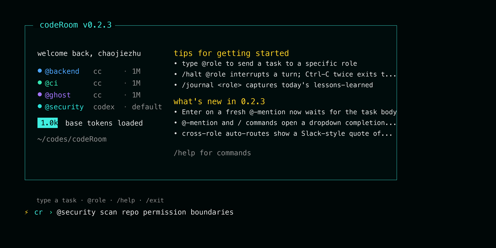
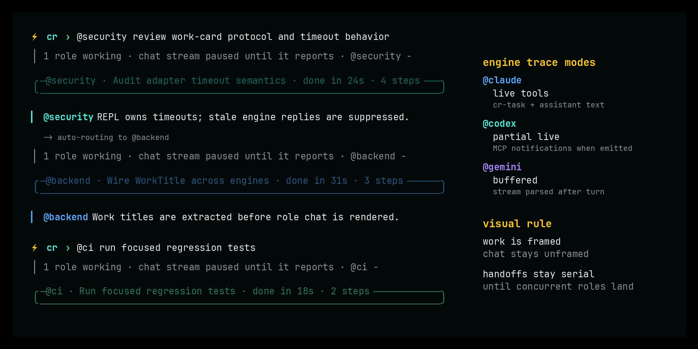

# CodeRoom

> A coordination shell for multi-role agent CLI sessions in a single chat-style
> terminal. Each role is a separate `claude` / `codex` / `gemini` subprocess,
> loaded with its own priors, addressed via `@`-mention. Cross-role messages
> route automatically.

[](https://github.com/spytensor/codeRoom/actions/workflows/ci.yml)
[](LICENSE)





> **Status: v0.2.3 — user-runnable, still pre-1.0.** Claude Code,
> Codex, and Gemini adapters are wired up; bare `cr` opens CodeRoom
> directly, guides setup when `.coderoom/` is missing, and shows the
> effective role / engine / model configuration on entry. **v0.2**
> drops the 5-minute wall-clock kill on long turns (the wrapper
> trusts each engine to self-terminate), adds `/halt` and two-press
> Ctrl-C for clean cancellation, renders role replies with markdown-lite
> formatting, streams Codex/Gemini output as it arrives, and refreshes
> WorkCard progress visibility. **v0.2.2** lands the chat-room UX
> polish: per-tool trace lines fold into the WorkCard, `@`/`/` tokens
> get a dropdown completion menu, cross-role auto-routes show a
> Slack-style quote of the parent reply, turn handoffs render as a
> full-width banner, and permission prompts collapse to a single line.
> Per semver, 0.x.y means the public API is not yet stable.

## Why

A single `CLAUDE.md` is a global namespace. As projects accumulate years of
conventions, one-off compliance rules, and decisions buried in commit messages
or comments, one file forces three problems: bloat, attention dilution, and
no way to express "this rule only matters to backend".

CodeRoom partitions organizational knowledge by role. Each role is a separate
agent CLI subprocess loaded with its own priors. The user `@`-mentions roles
to address them. Cross-role routing happens when one role writes `@x` in its
reply.

## What you get

- **Role-pinned engines.** `@backend` can run on `claude`, `@security` on
  `codex`, `@frontend` on `gemini`. No other tool does this today.
- **One chat stream, not split panes.** Single message log per project,
  colored by role.
- **Short role priors by default.** Generated roles start with compact
  responsibilities; long procedures and reference material belong in
  the underlying engine's skills or project docs, not every role prompt.
- **Daily journals.** Every role writes an end-of-session log with cited
  evidence. Auto-loaded for the next 7 days.
- **Patches.** `/patch <role> "..."` saves a session-time correction; the
  role picks it up on next refresh. v0.2 promotes high-signal patches into
  base priors.
- **Explicit engine capabilities.** Claude Code currently has the richest
  wrapper-visible event stream. Codex and Gemini expose tool traces where
  their CLIs emit them, and unsupported cost / permission fields are shown
  as `—` instead of fake zeroes.
- **Permission modes.** Projects can choose `ask`, `auto`, or `bypass`.
  Claude Code is gated by a CodeRoom-injected PreToolUse hook; Codex and
  Gemini approval support follows each engine's native protocol and is shown
  only when CodeRoom can supervise it.

## Status / Roadmap

| Milestone | Scope |
| --------- | ----- |
| v0.1 | Multi-engine REPL, role priors, `@` routing, patch / refresh / journal / show / cost, npm install |
| v0.1.x | First-run UI polish, config layering, updater, release hardening |
| **v0.2** (shipped) | Trust + interrupt: deleted wall-clock per-turn kill; `/halt` + Ctrl-C two-press; codex stdio idle watchdog; WorkCard polish (filled/open glyphs + per-tool accent colors); richer status line |
| **v0.2.2** (shipped) | Chat-room UX polish: folded per-tool traces, `@`/`/` dropdown completion menu, cross-role quote/reply block, full-width handoff banner, compact one-line permission prompts |
| v0.2.x | Concurrent typing during a turn + multi-role parallel dispatch + multi-slot status region |
| v0.3 | `cr review` (patch clustering), `cr verify` (journal fact-check) |
| v0.x | Team mode (per-role human owners), auto-router (opt-in), replay viewer |

See [docs/architecture.md](docs/architecture.md) for the v0.1 constitution,
[docs/v0.2-trust-and-interrupt.md](docs/v0.2-trust-and-interrupt.md) for
the v0.2 amendment, and [docs/spike-2026-05-09.md](docs/spike-2026-05-09.md)
for the feasibility spike that grounds the whole project.

## Install

```bash
npm install -g @spytensor/coderoom
cr --version
```

That's it. `cr` is now on your PATH. Same install story as
`@anthropic-ai/claude-code`, `@openai/codex`, and `@google/gemini-cli` —
which CodeRoom drives.

If `cr` conflicts with an existing command in your environment, npm also
installs `croom` as an alias for the same binary.

The npm package is a thin wrapper: on install, its postinstall script
downloads the right pre-built binary for your platform from the
matching [GitHub Release](https://github.com/spytensor/codeRoom/releases)
and verifies its SHA-256. Supported platforms: linux + macOS, x86_64 and
aarch64.

### Update

```bash
cr update   # check the npm registry for a newer version
cr upgrade  # install and verify the latest npm package
```

`cr start` also checks for updates in the background at most once per day.
Disable that with `CODEROOM_NO_UPDATE_CHECK=1` or
`[updates] check_on_start = false` in user config.

<details>
<summary>Don't have npm? Direct binary install.</summary>

```bash
TAG=v0.2.3
ARCH=$(uname -m); case "$ARCH" in arm64|aarch64) ARCH=aarch64 ;; *) ARCH=x86_64 ;; esac
OS=$(uname -s | tr '[:upper:]' '[:lower:]')
curl -fsSL "https://github.com/spytensor/codeRoom/releases/download/${TAG}/cr-${TAG}-${OS}-${ARCH}.tar.gz" \
  | tar -xz
sudo mv "cr-${TAG}-${OS}-${ARCH}/cr" /usr/local/bin/
cr --version
```

</details>

<details>
<summary>Building from source.</summary>

Requires Rust 1.85+. Use [rustup](https://rustup.rs) — the
distro-shipped `rustc` is usually too old (we depend on `edition2024`
in the wider ecosystem).

```bash
git clone https://github.com/spytensor/codeRoom
cd codeRoom
cargo build --release
sudo cp target/release/cr /usr/local/bin/
```

`cargo install --git ...` works too if your active toolchain is
1.85+; otherwise the install fails inside a transitive dep.

</details>

## Quickstart

```bash
cd your-project
cr                              # setup if needed, then enter the room
$EDITOR .coderoom/roles/host.md # optional: give @host real priors

cr › hello
[@host ready · model=claude-opus-4-7]
@host  Hi — what would you like to work on?

cr › @host scope out adding email verification
@host  This touches auth, DB schema, and probably the front-end signup flow…
```

Useful commands:

- `cr` and `cr start` both enter the room; if `.coderoom/` is missing, an
  interactive terminal gets the guided setup first.
- `cr start --yolo` runs the current session with `permission_mode=bypass`
  for every role after an interactive confirmation.
- Existing projects with only the default `@host` role get a local-scan
  role suggestion picker on entry, so users can add specialists without
  hand-editing config.
- `cr init` runs setup explicitly when you want to prepare the project without
  entering the REPL.
- `cr role add <name> --engine codex` adds or pins a specialist role.
- `cr role host <name>` persists a new host role; `/host <role>` swaps host
  for the current REPL session only.
- `@all <text>` broadcasts one prompt to every running role.
- `/patch <role> <text>`, `/refresh <role>`, `/transcript <role>`, and
  `/journal <role>` are available inside the REPL.
- `/halt` (no arg) interrupts every in-flight turn; `/halt @role`
  targets one. Roles stay alive — only the current turn ends.
- **Ctrl-C is two-press**: first press cancels in-flight turns (like
  bare `/halt`); a second press within 2 seconds force-stops every
  role and exits the REPL. Long-running scans no longer get killed
  at any wall-clock — the wrapper trusts each engine to self-terminate
  and the user to halt when something looks wrong.
- `/allow <tool>` and `/deny <tool>` update the session permission policy
  used by Claude Code hooks. Examples: `/allow Read`, `/deny Bash`.
- `cr show [--role backend] [--tail 20] [--since YYYY-MM-DD]`, `cr cost`,
  `cr compact <role>`, `cr config get/set`, and `cr update` handle
  inspection, spend tracking, priors compaction, layered config, and package
  upgrades.
- Live turns fold internal tool traces into one activity summary; `cr show`
  replays the full event log when you need to audit what happened. Set
  `CODEROOM_VERBOSE_TOOLS=1` to opt the live REPL back into the full
  per-tool trace stream when you need it inline.

## Engine Capability Matrix

| Capability | Claude Code (`cc`) | Codex | Gemini |
| ---------- | ------------------ | ----- | ------ |
| Prompt isolation | system-prompt file | MCP base instructions | requires `--system-instruction-file` |
| Tool trace events | proposed + executed | exec notifications when emitted | stream-json tool_use/tool_result |
| Cost reporting | per turn | — | — |
| Budget enforcement | native cap | — | — |
| Permission gating | `ask` / `auto` / `bypass` via PreToolUse hook | `ask` / `auto` / `bypass` via MCP approval bridge in live REPL | explicit `bypass` only |

`cr cost` excludes unsupported engines from the numeric total and marks them
with `—`. This is deliberate: older builds displayed `$0.00` for engines
that did not report reliable cost.

## Permission Modes

`permission_mode` can be set project-wide or per role:

```toml
permission_mode = "ask" # ask | auto | bypass

[roles.security]
engine = "codex"
permission_mode = "bypass"

[roles.research]
engine = "gemini"
permission_mode = "bypass"
```

- `ask` requests approval before tools that are not explicitly allowed. In a
  live REPL, Claude Code hooks and Codex MCP approvals surface as CodeRoom
  prompts; use `/allow <tool>` or choose "allow session" when you trust the
  call.
- `auto` allows low-risk read-only tools and asks for risky or unknown tools.
- `bypass` is explicit yolo mode. It is not required for Claude Code. Codex
  can run `ask` / `auto` only from a live REPL with a permission bridge;
  headless Codex runs still need `bypass`. In bypass mode, CodeRoom disables
  Codex's own command sandbox as well as approvals, matching the yolo semantics
  of the other adapters.
- For compatibility with projects created before per-role permission modes,
  Codex and Gemini roles that omit `permission_mode` run as `bypass`.
  Explicit `ask` or `auto` on Gemini still fails fast.

## Contributing

See [CONTRIBUTING.md](CONTRIBUTING.md). TL;DR: PRs follow conventional
commits, must pass `fmt + clippy + test` in CI, and must not amend a locked
architecture decision without an entry in
[`docs/proposed-amendments.md`](docs/proposed-amendments.md).

## License

MIT. See [LICENSE](LICENSE).
